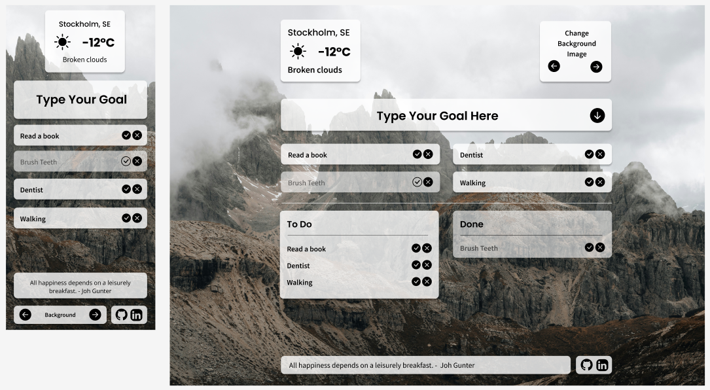

# Inspiration Hub

## The purpose of your project

To practice Redux and TypeScript with API.

## Features

### Weather

Fetch the local weather - Users can check the current weather
API: [Open Weather](https://openweathermap.org/api)

### Goals

- Create goals
- Mark goals as complete
- Remove goals

### Background Image

Cycle through multiple fetched images
API: [Unsplash](https://unsplash.com/developers)

### Quote

Random quote via [DummyJSON](https://dummyjson.com/docs/quotes).

## Tech Stack

- React
- Redux
- TypeScript
- Tailwind
- Vite

## How to Run the Project

```bash
npm run dev
```

## Demo

[Demo in Vercel](https://inspiration-hub-three.vercel.app)
[Demo in Netlify](https://inspiration-hub-yoko.netlify.app/)

## Figma


[Here is Figma Mockup](https://www.figma.com/design/FqOIghC8xOQT7G79WiBtGy/Inspiration-Hub?node-id=0-1&t=00c2HsxzJtL8hbx5-1)
